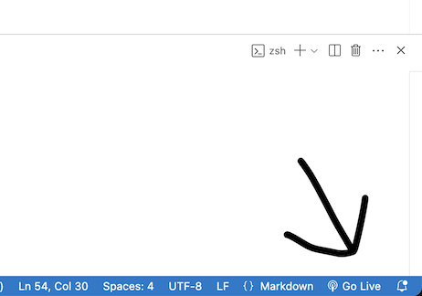
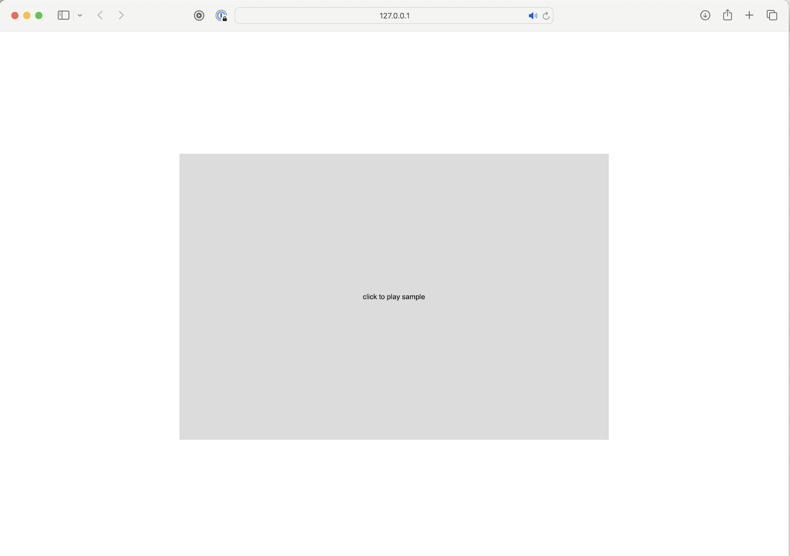
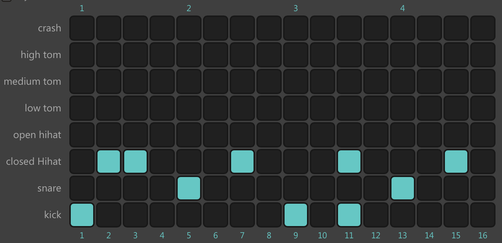

# Lo-fi beats with p5.js

 #### Assignment 1: Setup and first sound | 10 minutes

#### 1a - VSCode and p5js extension
Install VSCode and enable the [p5.vscode](https://marketplace.visualstudio.com/items?itemName=samplavigne.p5-vscode) extension. Follow the steps here:
 https://p5js.org/tutorials/setting-up-your-environment/#vscode
 
 When vscode is installed:
 - Clone this repo (it's also ok to just download the zip)
 - Open the folder in VSCode
 - Open `assignment-1.js`. This will be the first file we work in.
 - At the bottom right, click go live

 - Open the browser on http://localhost:5500
 - Click the canvas and you should hear a sound

 #### 1b - Changing the sample
 File: `assignment-1.js`
 - Browse the files in the `/sounds` folder to explore different sounds
    - On macOS, in Finder: spacebar = preview audio file quickly.
    - On Windows: enable "Preview Pane" in File Explorer.
 - Pick a new sound and change the path on line 9, inside the `preload()` function:

####
    function preload() {
        sound = loadSound('<insert new path here>');
    }

 - The browser page should refresh, and you should hear a different sample.
 - _If you're done and your neighbour is not, please see if you can help them out before proceeding:)_

Assignment 1 complete! 🎉

### Theory: layout of a p5.js sketch
A file with p5.js code is typically referred to as a "sketch".

When a sketch is ran, a number of functions are called by default, as shown in the example below.

`sketch.js`

    // Define variables
    let a = 0;
    let b = 1;

    function preload() {
        // Called before setup()
    }

    function setup() {
        // Called after preload() is done
        let cnv = createCanvas(720, 480);
        background(220);
    }

    function draw() {
        // Called once per frame (e.g. 60x/second); program realtime updates here.
    }

### Assignment 2: Recreating a lo-fi beat | 15 minutes

Song from the presentation: _Idealism - Controlla_ on [Spotify](https://open.spotify.com/track/7woCxOw0jmj65ohlQ3x0tH?si=af6255e2294d41bc) | [YouTube](https://www.youtube.com/watch?app=desktop&v=_mAPAtjWZGE&t=0s)

In this assignment we'll make a drum beat with a sense of unpredictability.

- Open `assignment-2.js`. It provides a structure for a 3-channel drum sequencer.
- In `index.html`, change the path on line 17 to `assignment-2.js`.

#### 2a - Sounds
Check the `sounds` folder in the repo. You can use VSCode to preview the sounds, or alternatively se Finder, Explorer or a media player like VLC.

You can change the sounds by modifying the paths in the `soundFiles` array. 

    let soundFiles = [
        'sounds/lofi-drums/kick/kick 01.wav', 
        '',
        '',
    ];

Update the soundFiles array with the `snare 02.wav` as sound 2, and `hat 05.wav` as sound 3.

    let soundFiles = [
        'sounds/lofi-drums/kick/kick 01.wav', 
        '<path to snare>',
        '<path to hihat>',
    ];

Before we try the sketch in the browser, we should make a sequence for each sound.

#### 2b - Sequences
Change the sequences to match our pattern:

Each step in the array corresponds to a step in the visual sequencer.

    // Each sequence in this array corresponds to a soundFile with the same index
    let sequences = [
        [0, 0, 0, 0,  0, 0, 0, 0,  0, 0, 0, 0,  0, 0, 0, 0],  // sequence for soundFiles[0] (Kick)
        [0, 0, 0, 0,  0, 0, 0, 0,  0, 0, 0, 0,  0, 0, 0, 0],  // sequence for soundFiles[1] (Snare)
        [0, 0, 0, 0,  0, 0, 0, 0,  0, 0, 0, 0,  0, 0, 0, 0],  // sequence for soundFiles[2] (Closed Hi-hat)
    ];

Change the `0` into a `1` if it should have a step at that point.

#### 2c - Playback rate and pitch
The numbers `0` and `1` in the sequences refer to playback rate. At half the playback rate, you'll hear it at half the pitch.

For the hi-hat sequence, try to alternate the playback speed between 0.9 and 1.1 for some variation:

    let sequences = [
        [1, 0, 0, 0,  0, 0, 0, 0,  1, 0, 1, 0,  0, 0, 0, 0],  // sequence for soundFiles[0] (Kick)
        [0, 0, 0, 0,  1, 0, 0, 0,  0, 0, 0, 0,  1, 0, 0, 0],  // sequence for soundFiles[1] (Snare)
        [0, 1, .9, 0,  0, 0, 1.1, 0,  0, 0, 0.95, 0,  0, 0, 1.1, 0],  // sequence for soundFiles[2] (Closed Hi-hat)
    ];

#### 2d - BPM
The original bpm of the song is 80. Change the bpm to 80 inside the setup function:

    // Tempo
    part.setBPM(80);

Also try some other values (e.g. 50, 120, 200) and see how it affects the loop.

#### 2e - Mixing

Some samples sound louder than others. You can use the setVolume function to control the loudness of the sounds. 

Let's make the kick a bit louder and the hats softer.

    // Mixing - volume is from 0 to 1
    sounds[0].setVolume(.4);
    sounds[1].setVolume(.2);
    sounds[2].setVolume(.1);

#### 2f - Algorithmic techniques

So far we've taken a fairly traditional approach to making electronic music - you define step by step want you want to hear.

The interseting bit of using code however, is that you can use coding structures like `for`-loops to modify your sequences.

Each sequence inside the `sequences` array can be modified in the `setup()` method. 
Add this to the `setup()` function after `makeCanvas();` :
 
    // randomSeed(99); // uncomment this line if you like random() to have the same outcome everytime you run the sketch
    for (i = 0; i < sequences[0].length; i++) {
        if (sequences[2][i] > 0) {
            sequences[2][i] = 0.5 + Math.random();
        }
    }

This will add random playback rates between 0.5 and 1.5 for the sounds in the first sequence.

Change the param to `randomSeed` for a different outcome.

##### 2g - Stretch goal, if you have some time left: 

- Can you make a `for`-loop that creates a sequence of 64 steps for the hi-hats, where each step is randomly assigned `0`, `0.5`, `1` or `2`?

  
Spoiler: answer for stretch goal

    sequences[2] = [];
    let choices = [0, 0.5, 1, 2];
    for (i = 0; i < 64; i++) {
        let x = Math.floor(Math.random() * 4);
        sequences[2].push(choices[x]);
    }

_Note: full solution can be found in_ `solutions/assignment-2-solution.js`.

Assignment 2 complete! 🎉

### Assignment 3: Build your own lofi loop | 30 minutes

Open `assignment-3.js`. It provides a structure for an 8-channel drum sequencer. In `index.html` edit the path to use it.

Time to make your own lofi loop! You can use the samples as found in the sounds folder.

##### How to make a song?
Feel free to this all on your own - but if you'd like a bit more guidance, you could roughly follow these steps:

- Set the BPM between 70 and 90
- Pick a few sounds:
    - 1 from `sounds/lofi-drums/kick`
    - 2 from `sounds/lofi-drums/snare`
    - 2 from `sounds/lofi-drums/hi-hats`
    - 1 from `sounds/lofi-drums/fx`
    - 1 from `sounds/chords`
- Add a sequence for each song:
    - Make the sequences between 16 and 64 steps (a multiple of 8 works nicely)
    - Tip: not every sequence needs to be the same length. For fun, you can create a few odd ones with 5 or 17 steps. 
    - For the first 3 sounds, you can use the sequence from `assignment-2.js` Change a few things to see how it evolves.
    - For the rest of the sounds, start by placing a single `1` in the sequence. See if it also sounds cool with `0.5` or `2.0`; then add some more if the song has space for more
    - Careful with the number of piano/guitar samples, they can fill your song up (too) quickly!
    - Chords sounds are great to shift in pitch. Try 0.5, 0.75, and 1.25!
- Mix the song by setting a good volume for each sound.
- Done!

##### More tips
- Feel free to use https://drumbit.app for this part of the assignment to quickly experiment with what kind of rhythms you like, before programming them in your code.
- Optionally, you can use any samples from the internet by downloading them and adding them to the `/sounds` folder. A good source is freesound.org. 
- The beats from the previous assignment may serve as a nice starting point. 
- Explore the sounds in the repository and make note of which ones you like best.
- You can collect all the sounds you like in an array and load them all in the preload() function; then you can switch quickly (or programmatically) between sounds without editing paths. 
- Use `for`/`while` loops to generate or modify sequences; this can inspire you with new results.
- Try to use about 5-10 different sounds. This should be plenty to create something interesting.
- Experiment with bpm; this makes a huge difference for the feel of your song. 
    - 70-90 can be considered slow; typical for lo-fi, hip-hop and ballads;
    - 90-120 is a medium range, typical for many pop songs;
    - 120-140 is fast, most electronic genres like house and techno fall in this range
    - 140-180 is very fast, genres like Drum n Bass fall into this category
- If you don't want to hear a sound, set the sequence  to `[0, ]` - otherwise, if left empty (`[]`), the default playback rate of 1 is used in the callback, and you'll hear the sound at all steps.
- Use the developer console to check for any errors

For an example of a final solution, change the path in index.html to `solutions/assignment-3-example.js`. 

Want to save your result as mp3? Checkout [this chrome extension](https://chromewebstore.google.com/detail/chrome-audio-capture/kfokdmfpdnokpmpbjhjbcabgligoelgp).

Workshop complete! 🎉
